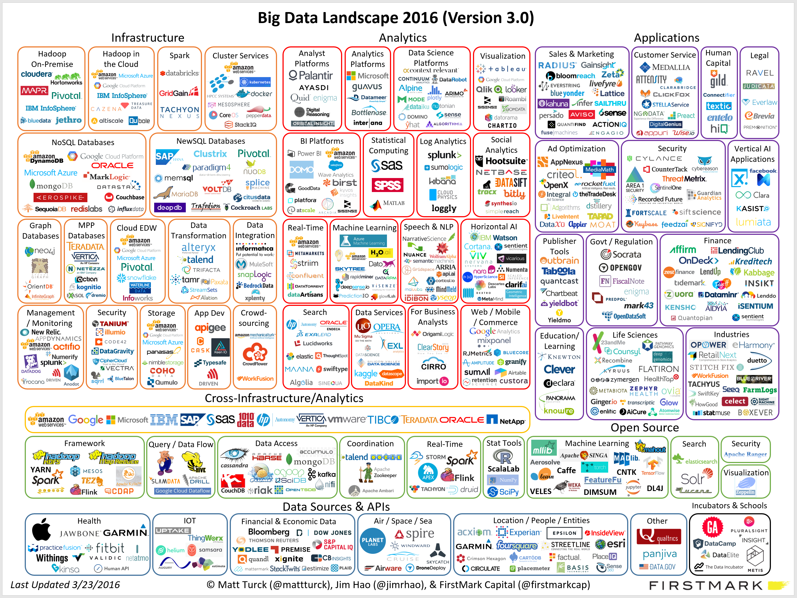
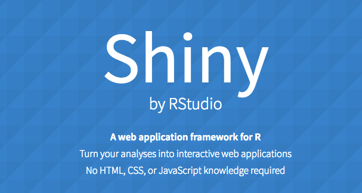
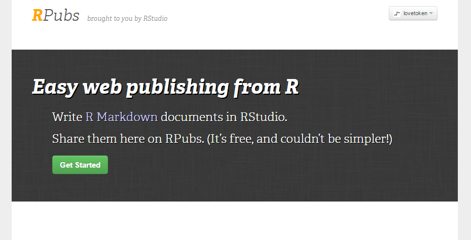

```{r env, echo=FALSE, warning=FALSE, message=FALSE}
## attach library
pacman::p_load("knitr", "dplyr", "ggplot2", "revealjs", "rmarkdown",
               "revealjs", "numbers", "data.table")
opts_chunk$set(fig.path = "output/figure/", fig.align = "center", out.width = "80%", 
               warning = F, message = F)
```

# 데이터 분석 패러다임

## 3C

>- Connectivity
>- Cloud
>- Computer science

## Connectivity

>- 인터넷과 웹의 급격한 발전으로  
정보습득이 점점 쉬워지고 접근성이 높아짐
>- **데이터의 습득**도 이와 마찬가지

## Cloud

>- 정보와 기술의 배포가 가속화 되고 있는 계기
>- 최근에 이어 지금까지도  
정말 빠르게 우리의 실생활에 녹아들고 있음

## Computer science

>- 아날로그에서 디지털로 데이터를 관리함으로써  
다양한 혁신이 생기고 있음
>- Computing power 를 이용해  
독자적인 아이디어를 구현해 볼 수 있고 연구할 수 있게됨

---

```{r echo = F}

```

# 데이터 분석에 프로그래밍을 접목하려는 목적

------

>- 3C의 패러다임을 적극적으로 이용
>- 자신의 아이디어를 믿고 주체적으로 표현 (Realize tool)
>- 훌륭한 아이디어를 망각하지 않고 재활용

# R을 통해 데이터 분석과 프로그래밍의 첫번째 융합

## Easy Start using Small Data

------

```{r fig.height = 6}
x <- c(0, 1, 2, 3)
y <- c(0, 2, 3, 4)
plot(x, y)
```

------

```{r fig.height = 6}
lmfit <- lm(y ~ x)
plot(x, y)
abline(coefficients(lmfit)[1], coefficients(lmfit)[2])
```

분석기반을 Small data 를 통해 만들고 시작

------

```{r SLR1, fig.show = "animate", interval = .05, echo = F, cache = T}
for(i in 1:400){
	add_x <- abs(rnorm(1))
	add_y <- add_x + abs(rnorm(1))
	x <- append(x, add_x)
	y <- append(y, add_y)

	lmfit <- lm(y ~ x)
	plot(x, y, xlim = c(0, 3), ylim = c(0, 4))
	abline(coefficients(lmfit)[1], coefficients(lmfit)[2])
}
```

데이터의 반영 및 결과 리포팅은 컴퓨터에게 맡김

------

```{r SLR2, fig.show = "animate", interval = .05, echo = F, cache = T}
x <- c(0, 1, 2, 3)
y <- c(0, 2, 3, 4)

for(i in 1:400){
	add_x <- abs(rnorm(1))
	add_y <- add_x + abs(rnorm(1))
	x <- append(x, add_x)
	y <- append(y, add_y)
	pd <- data.frame(y, x)

	p <- ggplot(pd, aes(x = x, y = y)) + geom_point() + 
	  stat_smooth(method = "lm") + 
	  lims(x = c(0, 3), y = c(0, 4))
	print(p)
}
```

------

```{r SLR3, fig.show = "animate", interval = .05, echo = F, cache = T}
x <- c(0, 1, 2, 3)
y <- c(0, 2, 3, 4)

for(i in 1:300){
	add_x <- abs(rnorm(1))
	add_y <- add_x + abs(rnorm(1))
	x <- append(x, add_x)
	y <- append(y, add_y)
	pd <- data.frame(y, x)

	p <- ggplot(pd, aes(x = x, y = y)) + geom_point() + 
	  stat_smooth(method = "loess") + 
	  lims(x = c(0, 3), y = c(0, 4))
	print(p)
}
```

------

단순하고 반복적인 성격의 일들을 컴퓨터에게 최대한 맡기고 우리는 

>- 어떻게 분석할 것인지 기획하고
>- 서비스의 질을 어떻게 높일 것인지
>- **좀 더 이성적이고 본질적인 고민을 하자**

## Realize your idea

>- 백문이 불여일견
>- 자신의 생각을 구현시키고
>- 성취감을 얻으며 자신감 얻기

# 오픈소스를 이용한 분석의 자유도 높이기

------

```{r echo = F}

```

------

> 바퀴를 다시 발명하지 마라 - 작자 미상

>- 오픈소스를 일방적으로 이용해 보면서 오픈소스 생태계 이해하기
>- 기술확산에 자연스럽게 기여

## 오픈소스의 지향점

> 1. 소스코드 공개
> 2. 사람들이 무료로 사용
> 3. 사람들의 사용경험을 통해 제품이 점점 좋아짐
> 4. 더 많은 사람들이 사용
> 5. 버그발견, 기능추가, 문서보강, 새로운 아이디어

------

> 3. 사람들의 사용경험을 통해 제품이 점점 좋아짐
> 4. 더 많은 사람들이 사용
> 5. 버그발견, 기능추가, 문서보강, 새로운 아이디어

------

> 3. 사람들의 사용경험을 통해 제품이 점점 좋아짐
> 4. 더 많은 사람들이 사용
> 5. 버그발견, 기능추가, 문서보강, 새로운 아이디어

------

**선순환 고리**

## 목적 지향적

>- 바퀴를 재 발명하지 않음으로써 얻을 수 있는 여유
>- 시간비용, 자금을 아끼고 각자의 목적에 좀 더 민첩하게 다가가기

## 오픈소스 라이센스 R

>- R 언어는 GPL(General Public License) 를 채택
>- 사용자들이 소프트웨어를 자유롭게 공유하고 내용을 수정하도록 보증
>- R 상에서의 수많은 확장 패키지들 역시 GPL

## R package

>- R 을 이용할 때 분석의 자유도를 손쉽게 높일 수 있는 수단
>- R 사용자 들만의 또 다른 오픈소스 생태계로 볼 수 있음

# 데이터 분석결과의 공유와 소통 / 데이터의 오픈과 배포

## 배포의 중요성

>- 분석 이후에는 (PT, 강의, 배포등등 어떠한 방법이 되었든) 남에게 알리는 과정이 항상 맞물리게 됨
>- 분석결과가 유의미 해도 이를 아무에게도 알리지 않으면 큰 의미가 없음

## 배포방법의 중요성

>- 배포 특성상 완벽성을 기해야 하므로 엄청난 정성과 고통이 필요한 것이 사실
>- 프로그래밍을 이용해 생산성을 끌어올리고 고통에서 벗어날 필요가 있음

## Reproducible Research

>- 자신의 아이디어가 즉각 재현가능하고
>- 부담없이 재생산 가능하도록
>- 복사 <kbd>Ctrl</kbd> + <kbd>C</kbd>, 붙여넣기 <kbd>Ctrl</kbd> + <kbd>V</kbd> 패러다임의 탈피

------

[R markdown](http://rmarkdown.rstudio.com/)

<iframe width="100%" height="600" src="https://www.youtube.com/embed/s3JldKoA0zw?list=PL9HYL-VRX0oSFL5cDLSwDa8jKAa9RG8UR" frameborder="0" allowfullscreen></iframe>

------

[Shiny](https://shiny.rstudio.com/) [(Koroad Dashboard example)](http://127.0.0.1:4334)

```{r echo = F}

```

------

[Rpubs](http://rpubs.com/)

```{r echo = F}

```

------

## Q & A